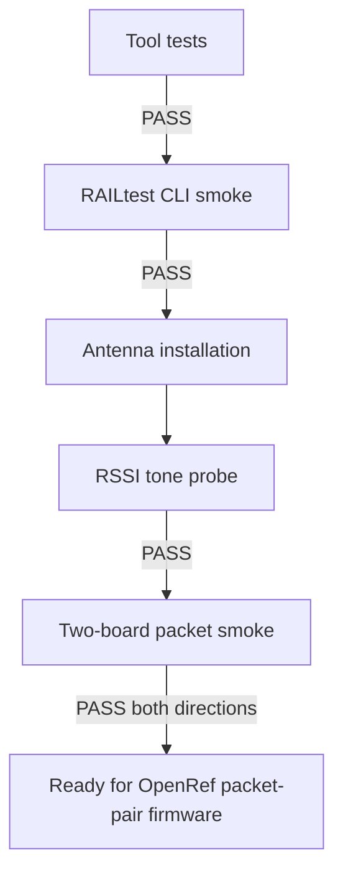

# 20260807 E0-01 and RAILtest Link Smoke Result

**Date:** 2026-08-07  
**Status:** E0-01 pass; RAILtest packet-link smoke pass after antenna installation

## Summary



Two `FG23-DK2600A` boards were flashed with the Silicon Labs `RAIL - SoC
RAILtest` example. Both boards enumerate as SEGGER USB serial devices and both
respond to RAILtest CLI commands.

Initial packet exchange attempts without antennas did not pass. After attaching
the supplied sub-GHz antennas to both boards, RSSI tone probing showed a strong
receiver energy increase and short RAILtest packet exchange passed in both
directions.

## Hardware and Toolchain

| Item | Value |
|---|---|
| Boards | 2x `FG23-DK2600A` |
| Board/project target | `BRD2600A rev A03`, `EFR32FG23B010F512IM48` |
| Simplicity Studio | `6.0.0 / Studio 289` |
| SDK | Simplicity SDK `2026.6.1` |
| Example | `RAIL - SoC RAILtest` / `rail_soc_railtest` |
| PHY profile | `PHY_Studio_868M_GMSK_500Kbps` |
| Channel config | Base frequency `868000000`, channel 0, 1 MHz spacing |
| TX power reported by RAILtest | `power:100` deci-dBm, 10.0 dBm |
| Serial ports during test | `COM8`, `COM10` |

## Commands Run

| Test | Command | Result |
|---|---|---|
| Tool unit tests | `python -B -m pytest -p no:cacheprovider tools\tests --basetemp .pytest-tmp` | Pass, `9 passed` |
| RAILtest CLI smoke | `python tools\railtest_smoke.py` | Pass, both boards responded |
| Packet smoke, COM8 RX / COM10 TX | `python tools\railtest_pair_smoke.py --rf-path 0` | Pass after antennas, packet exchange observed |
| Packet smoke, COM10 RX / COM8 TX | `python tools\railtest_pair_smoke.py --rx-port COM10 --tx-port COM8 --rf-path 0` | Pass after antennas, packet exchange observed |
| RSSI probe, path 0, COM8 RX / COM10 TX | `python tools\railtest_rssi_probe.py --rf-path 0` | Pass after antennas, RSSI `-91.25` to `-26.75` dBm |
| RSSI probe, path 0, COM10 RX / COM8 TX | `python tools\railtest_rssi_probe.py --rx-port COM10 --tx-port COM8 --rf-path 0` | Pass after antennas, RSSI `-90.50` to `-26.75` dBm |
| RSSI probe, path 1, COM8 RX / COM10 TX | `python tools\railtest_rssi_probe.py --rf-path 1` | Fail, no useful RSSI rise; `-114.50` to `-114.50` dBm |
| RSSI probe, path 1, COM10 RX / COM8 TX | `python tools\railtest_rssi_probe.py --rx-port COM10 --tx-port COM8 --rf-path 1` | Fail, no useful RSSI rise; `-114.00` to `-114.50` dBm |

## Observations

| Check | Observation |
|---|---|
| CLI command path | Both boards respond to `help`, proving serial I/O and flashed firmware are alive. |
| TX command path | `tx 20` reports `txStatus:Complete` and `transmitted:20`. |
| RX command path | Receiver enters RX mode and packet exchange is observed after antennas are attached. |
| RF path 0 RSSI | With antennas attached, COM8 RX / COM10 TX improved from `-91.25` to `-26.75` dBm and COM10 RX / COM8 TX improved from `-90.50` to `-26.75` dBm during TX tone. |
| RF path 1 RSSI | With antennas attached, RSSI stayed near the noise floor in both directions. |

## Decision

- E0-01 toolchain reproduction can be treated as passed for this machine and
  board pair.
- Antennas are required for valid RF bring-up.
- Proceed to OpenRef-owned packet-pair firmware for E0-02.
- Use RF path 0 for the current bench setup unless later board documentation
  proves another path is intended.
- Rerun this smoke check before each packet-pair session:

```powershell
python tools\railtest_pair_smoke.py --rf-path 0
```

## Next Checks

1. Keep both supplied sub-GHz antennas installed for all RF tests.
2. Keep boards about 1 m apart and away from laptop chassis, hubs, and metal.
3. Create OpenRef-owned packet-pair firmware with sequence-numbered packets.
4. Run a short E0-02 precheck before attempting the one-hour run.
5. Capture packet-pair logs in the analyzer CSV format.
