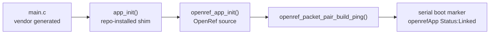

# 20260807 OpenRef App Hook Result

**Date:** 2026-08-07  
**Boards:** 2x FG23-DK2600A / BRD2600A rev A03  
**Generated project:** `rail_soc_railtest` in Simplicity Studio workspace  
**Image:** rebuilt `rail_soc_railtest.hex` with OpenRef overlay and app shim

## Hook Path



## What Changed

- Added `openref_app.c/.h` to the repository-owned FG23 source area.
- Updated `tools/install_openref_fg23_overlay.ps1` to copy the app files into
  the local Simplicity overlay.
- Added `-InstallAppShim` to the installer. This backs up the generated
  `app.c` to `.openref-backup/app.c` and replaces it with a shim that calls
  `openref_app_init()` and `openref_app_process_action()`.
- Updated overlay CMake include paths for both `rail_soc_railtest` and the
  generated `slc` object target.

## Build and Flash

Build:

```powershell
powershell -ExecutionPolicy Bypass -File tools\install_openref_fg23_overlay.ps1 -InstallAppShim
cmake --workflow --preset project
```

Flash:

```powershell
commander flash rail_soc_railtest.hex --serialno 440320955
commander flash rail_soc_railtest.hex --serialno 440320878
```

Both flash operations completed successfully.

## Boot Marker

Both boards printed this marker after hardware reset:

```text
{{(openrefApp)}{Status:Linked}{PacketBytes:78}{Sequence:1}}}
```

Evidence:

| Port | Log |
|---|---|
| COM8 | `firmware/prototype0/fg23/results/20260807-openref-hook-com8.log` |
| COM10 | `firmware/prototype0/fg23/results/20260807-openref-hook-com10.log` |

## Post-Flash Sanity

| Test | Result |
|---|---|
| RAILtest CLI smoke | Pass on COM8 and COM10 |
| OpenRef packet RF check, COM10 -> COM8 | 10/10 decoded, 0 missing, 0 duplicates |
| OpenRef packet RF check, COM8 -> COM10 | 10/10 decoded, 0 missing, 0 duplicates |

Post-flash OpenRef packet summaries:

| Direction | Summary |
|---|---|
| COM10 -> COM8 | `firmware/prototype0/fg23/results/20260807-openref-hook-com8-rx-10-summary.json` |
| COM8 -> COM10 | `firmware/prototype0/fg23/results/20260807-openref-hook-com10-rx-10-summary.json` |

## Remaining Firmware Work

The app hook proves OpenRef code is linked, flashed, and called on boot. The
next step is the actual runtime radio adapter: scheduled TX, RX packet callback,
compact counters, and role selection for packet-pair TX/RX operation without
using RAILtest CLI commands.
