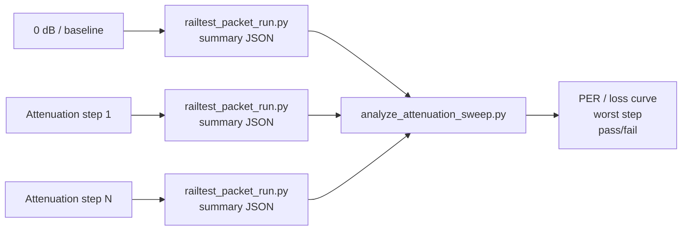

# 20260807 OpenRef Controlled Attenuation Analysis Plan

**Date:** 2026-08-07  
**Gate:** E0-05 controlled attenuation  
**Status:** Host analysis path ready; physical attenuation/shielding still required

## Purpose

E0-05 needs proof that the radio path behaves predictably as link margin is
reduced. The current bench does not have a calibrated attenuator or repeatable
shielding fixture, so the gate cannot be completed yet. This plan defines the
evidence format and analyzer so packet summaries from each physical attenuation
step become a repeatable pass/fail result.



## Capture Procedure

Before running the physical sweep, generate and fill a readiness file:

```powershell
python tools\prototype0_fixture_readiness.py --gate E0-05 --template --json firmware\prototype0\fg23\results\YYYYMMDD-e0-05-readiness.json
python tools\prototype0_fixture_readiness.py --gate E0-05 --check firmware\prototype0\fg23\results\YYYYMMDD-e0-05-readiness.json
python tools\run_prototype0_fixture_analysis.py --readiness firmware\prototype0\fg23\results\YYYYMMDD-e0-05-readiness.json --dry-run
```

For each physical attenuation step, run the same packet check and save a
distinct summary file:

```powershell
python tools\railtest_packet_run.py --rx-port COM8 --tx-port COM10 --packets 200 --payload-bytes 60 --tx-delay-ms 20 --settle-seconds 30 --rf-path 0 --summary-json firmware\prototype0\fg23\results\YYYYMMDD-e0-05-step-00-baseline.json
```

Repeat after adding attenuation or shielding:

```powershell
python tools\railtest_packet_run.py --rx-port COM8 --tx-port COM10 --packets 200 --payload-bytes 60 --tx-delay-ms 20 --settle-seconds 30 --rf-path 0 --summary-json firmware\prototype0\fg23\results\YYYYMMDD-e0-05-step-01-shielded.json
```

Analyze all steps through the readiness-driven runner:

```powershell
python tools\run_prototype0_fixture_analysis.py --readiness firmware\prototype0\fg23\results\YYYYMMDD-e0-05-readiness.json --json firmware\prototype0\fg23\results\YYYYMMDD-e0-05-run-report.json
```

The runner invokes `tools\analyze_attenuation_sweep.py` with the baseline and
attenuated summary paths declared in readiness metadata.

## Required Evidence

| Evidence | Requirement |
|---|---|
| Baseline packet summary | Near-clean link before attenuation |
| One or more attenuated packet summaries | Same packet count, payload, RF path, and direction as baseline |
| Analyzer summary JSON | Packet error rate, lost packets, delivery ratio, and worst step |
| Physical setup note | Attenuator values or shielding method must be recorded |

## Pass Interpretation

For an informal shielding precheck, the analyzer passes when at least two valid
steps exist and one step shows packet error rate at or above the configured
threshold. For a final calibrated E0-05 result, replace the label names with
actual attenuation values in dB and record the physical attenuator or shield
setup in the result document.
