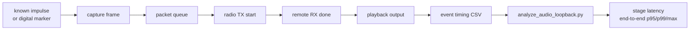

# 20260807 OpenRef Audio Loopback Analysis Plan

**Date:** 2026-08-07  
**Gate:** E0-07 audio loopback timing  
**Status:** Host analysis path ready; audio fixture and firmware markers still required

## Purpose

E0-07 establishes the measurement method for one-way audio latency before codec
selection and six-node mixing. The current FG23 bench has no audio capture or
playback path, so E0-07 cannot be completed yet. This plan defines the timing
events, CSV format, and analyzer needed once the fixture exists.



## Event CSV Contract

Before capturing fixture data, generate and fill a readiness file:

```powershell
python tools\prototype0_fixture_readiness.py --gate E0-07 --template --json firmware\prototype0\fg23\results\YYYYMMDD-e0-07-readiness.json
python tools\prototype0_fixture_readiness.py --gate E0-07 --check firmware\prototype0\fg23\results\YYYYMMDD-e0-07-readiness.json
python tools\run_prototype0_fixture_analysis.py --readiness firmware\prototype0\fg23\results\YYYYMMDD-e0-07-readiness.json --dry-run
```

Use one row per observed event:

```csv
frame_id,event,time_us
1,impulse,0
1,capture_frame,10000
1,packet_queue,30000
1,tx_start,35000
1,rx_done,60000
1,playback_output,90000
```

Required event labels:

| Event | Meaning |
|---|---|
| `impulse` | Known audio impulse, electrical impulse, or digital input marker |
| `capture_frame` | Firmware creates the audio frame from captured samples |
| `packet_queue` | Audio frame is queued for radio transmission |
| `tx_start` | Radio transmission starts |
| `rx_done` | Remote node receives and validates the packet |
| `playback_output` | Playback output edge or analog impulse is observed |

Alternative labels are allowed if they are mapped with repeated `--event`
arguments.

## Analyze Command

```powershell
python tools\run_prototype0_fixture_analysis.py --readiness firmware\prototype0\fg23\results\YYYYMMDD-e0-07-readiness.json --json firmware\prototype0\fg23\results\YYYYMMDD-e0-07-run-report.json
```

If a scope or logic analyzer export uses different marker names:

```powershell
python tools\prototype0_fixture_readiness.py --gate E0-07 --fill --set "fixture_method=wired DAC output into ADC capture fixture" --set firmware_timing_markers=true --set output_csv=firmware/prototype0/fg23/results/YYYYMMDD-e0-07-audio-loopback.csv --audio-event impulse=audio_in --audio-event capture=frame_ready --audio-event queue=queued --audio-event tx_start=radio_start --audio-event rx=radio_rx --audio-event playback=audio_out --json firmware\prototype0\fg23\results\YYYYMMDD-e0-07-readiness.json
python tools\run_prototype0_fixture_analysis.py --readiness firmware\prototype0\fg23\results\YYYYMMDD-e0-07-readiness.json --dry-run
```

The runner invokes `tools\analyze_audio_loopback.py` with the latency thresholds
and `--event` mappings declared in readiness metadata.

## Required Evidence

| Evidence | Requirement |
|---|---|
| Raw timing CSV | At least 10 complete impulse-to-playback chains for the first method check |
| Summary JSON | Capture, queue, radio, playback, and end-to-end latency stats |
| Fixture notes | Electrical or acoustic loopback method, sampling instrument, and trigger setup |
| Firmware build notes | Marker implementation and board roles |

## Pass Interpretation

The analyzer passes when:

- complete samples meet or exceed `--expected-samples`;
- end-to-end p95 latency is at or below the target, initially 120 ms;
- maximum end-to-end latency is at or below the review limit, initially 180 ms.

For early fixture bring-up, failing latency is still useful evidence if the
event chain is complete. For final E0-07, missing capture/playback markers or
unbounded latency fails the gate. Non-monotonic event chains also fail: each
stage must occur at or after the previous event for the same frame.
