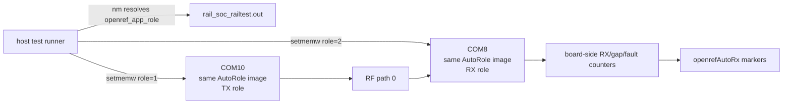

# 20260807 OpenRef AutoRole Same-Image Result

**Date:** 2026-08-07  
**RX board:** COM8 / SEGGER `440320955`  
**TX board:** COM10 / SEGGER `440320878`  
**RF path:** default/path 0 bench path  
**Packet:** OpenRef prototype packet, 18-byte header + 60-byte payload = 78 bytes

## Test Shape



This closes the role-image gap from the AutoRX test: both boards are flashed
with the same OpenRef AutoRole image, and the host selects each board's role at
runtime by writing the `openref_app_role` RAM variable through the RAILtest
`setmemw` command.

## Commands

Build and flash the shared AutoRole image:

```powershell
powershell -ExecutionPolicy Bypass -File tools\install_openref_fg23_overlay.ps1 -InstallAppShim -EnableAutoRole
cmake --workflow --preset project
commander flash rail_soc_railtest.hex --serialno 440320955
commander flash rail_soc_railtest.hex --serialno 440320878
```

Run the board-owned counter test:

```powershell
python tools\openref_autorole_run.py --rx-port COM8 --tx-port COM10 --rf-path 0 --duration-seconds 300 --expected-rx 700 --summary-json firmware\prototype0\fg23\results\20260807-openref-autorole-5min-com8-rx-summary.json
```

Run the one-hour E0-02 packet-pair test:

```powershell
python tools\openref_autorole_run.py --rx-port COM8 --tx-port COM10 --rf-path 0 --duration-seconds 3600 --expected-rx 9000 --summary-json firmware\prototype0\fg23\results\20260807-openref-autorole-1hour-com8-rx-summary.json
```

## Results

| Run | Duration | Expected RX | Last board RX counter | Last sequence | Gaps | Faults | Result |
|---|---:|---:|---:|---:|---:|---:|---|
| Short sanity | 30 s | 50 | 75 | 75 | 0 | 0 | Pass |
| Five-minute precheck | 300 s | 700 | 850 | 850 | 0 | 0 | Pass |
| E0-02 one-hour run | 3600 s | 9000 | 10275 | 10275 | 0 | 0 | Pass |

Evidence:

| Evidence | Path |
|---|---|
| Short summary JSON | `firmware/prototype0/fg23/results/20260807-openref-autorole-com8-rx-summary.json` |
| Short RX raw log | `firmware/prototype0/fg23/results/20260807-211811-openref-autorole-com8-rx.log` |
| Short TX raw log | `firmware/prototype0/fg23/results/20260807-211811-openref-autorole-com10-tx.log` |
| Five-minute summary JSON | `firmware/prototype0/fg23/results/20260807-openref-autorole-5min-com8-rx-summary.json` |
| Five-minute RX raw log | `firmware/prototype0/fg23/results/20260807-211851-openref-autorole-com8-rx.log` |
| Five-minute TX raw log | `firmware/prototype0/fg23/results/20260807-211851-openref-autorole-com10-tx.log` |
| One-hour summary JSON | `firmware/prototype0/fg23/results/20260807-openref-autorole-1hour-com8-rx-summary.json` |
| One-hour RX raw log | `firmware/prototype0/fg23/results/20260807-212738-openref-autorole-com8-rx.log` |
| One-hour TX raw log | `firmware/prototype0/fg23/results/20260807-212738-openref-autorole-com10-tx.log` |

## Bench Restore

After evidence capture, the normal non-AutoTX/non-AutoRX/non-AutoRole OpenRef
hook image was rebuilt and flashed back to both boards. A RAILtest CLI smoke
test passed afterward, confirming both boards respond as normal shell images.

```powershell
powershell -ExecutionPolicy Bypass -File tools\install_openref_fg23_overlay.ps1 -InstallAppShim
cmake --workflow --preset project
commander flash rail_soc_railtest.hex --serialno 440320955
commander flash rail_soc_railtest.hex --serialno 440320878
python tools\railtest_smoke.py
```

## Remaining Gap

E0-02 now has board-owned TX, board-owned RX counters, same-image runtime role
selection, and a passing one-hour packet-pair run. Product firmware still needs
a durable role/config surface; the bench runner's `setmemw` role switch is an
engineering test control, not the final user workflow.
