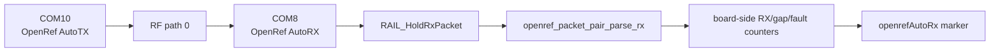

# 20260807 OpenRef AutoRX Board-Side Counter Result

**Date:** 2026-08-07  
**TX board:** COM10 / SEGGER `440320878`, OpenRef AutoTX image  
**RX board:** COM8 / SEGGER `440320955`, OpenRef AutoRX image  
**RF path:** default/path 0 bench path  
**Packet:** OpenRef prototype packet, 18-byte header + 60-byte payload = 78 bytes

## Test Shape



This is stronger than PC-side `rxPacket` parsing: the receiving board holds
RAIL packets, copies the packet bytes in its app loop, decodes the OpenRef
header, updates packet-pair counters, and prints compact counter markers.

## Commands

AutoRX image for COM8:

```powershell
powershell -ExecutionPolicy Bypass -File tools\install_openref_fg23_overlay.ps1 -InstallAppShim -EnableAutoRx
cmake --workflow --preset project
commander flash rail_soc_railtest.hex --serialno 440320955
```

AutoTX image for COM10:

```powershell
powershell -ExecutionPolicy Bypass -File tools\install_openref_fg23_overlay.ps1 -InstallAppShim -EnableAutoTx
cmake --workflow --preset project
commander flash rail_soc_railtest.hex --serialno 440320878
```

Board-side counter capture:

```powershell
python tools\openref_autorx_marker_run.py --rx-port COM8 --tx-port COM10 --duration-seconds 300 --expected-rx 700 --summary-json firmware\prototype0\fg23\results\20260807-openref-autorx-5min-com8-summary.json
```

## Results

| Run | Duration | Expected RX | Last board RX counter | Last sequence | Gaps | Faults | Result |
|---|---:|---:|---:|---:|---:|---:|---|
| Short sanity | 30 s | 50 | 200 | 200 | 0 | 0 | Pass |
| Five-minute precheck | 300 s | 700 | 1100 | 1100 | 0 | 0 | Pass |

Evidence:

| Evidence | Path |
|---|---|
| Short summary JSON | `firmware/prototype0/fg23/results/20260807-openref-autorx-com8-summary.json` |
| Short RX raw log | `firmware/prototype0/fg23/results/20260807-210743-openref-autorx-com8-rx.log` |
| Short TX raw log | `firmware/prototype0/fg23/results/20260807-210743-openref-autorx-com10-tx.log` |
| Five-minute summary JSON | `firmware/prototype0/fg23/results/20260807-openref-autorx-5min-com8-summary.json` |
| Five-minute RX raw log | `firmware/prototype0/fg23/results/20260807-210820-openref-autorx-com8-rx.log` |
| Five-minute TX raw log | `firmware/prototype0/fg23/results/20260807-210820-openref-autorx-com10-tx.log` |

## Bench Restore

After evidence capture, the normal non-AutoTX/non-AutoRX OpenRef hook image was
rebuilt and flashed back to both boards:

```powershell
powershell -ExecutionPolicy Bypass -File tools\install_openref_fg23_overlay.ps1 -InstallAppShim
cmake --workflow --preset project
commander flash rail_soc_railtest.hex --serialno 440320955
commander flash rail_soc_railtest.hex --serialno 440320878
```

## Remaining Gap

E0-02 now has a 5-minute board-owned TX/RX precheck with OpenRef counters.
Remaining work before treating E0-02 as fully closed:

- Add role selection that does not require rebuilding/flashing different
  AutoTX/AutoRX images.
- Run the one-hour packet-pair test with the board-owned counters.
- Decide whether the final Prototype 0 firmware should keep using the RAILtest
  shell or split into a smaller dedicated OpenRef app.
