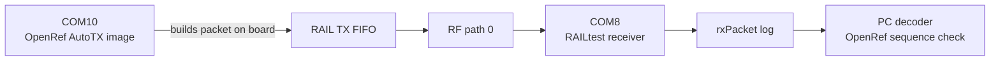

# 20260807 OpenRef AutoTX Result

**Date:** 2026-08-07  
**TX board:** COM10 / SEGGER `440320878`  
**RX board:** COM8 / SEGGER `440320955`  
**RF path:** 0  
**Packet:** OpenRef prototype packet, 18-byte header + 60-byte payload = 78 bytes

## Test Shape



This is the first test where the transmitting board generated OpenRef packet
bytes itself. The PC still configured the receiver and decoded the logs, but it
did not load each transmit payload through the RAILtest CLI.

## Commands

AutoTX image build:

```powershell
powershell -ExecutionPolicy Bypass -File tools\install_openref_fg23_overlay.ps1 -InstallAppShim -EnableAutoTx
cmake --workflow --preset project
```

Flash AutoTX image to COM10:

```powershell
commander flash rail_soc_railtest.hex --serialno 440320878
```

Receive/decode run:

```powershell
python tools\railtest_openref_autotx_rx.py --rx-port COM8 --tx-port COM10 --rf-path 0 --expected-packets 10 --duration-seconds 8 --summary-json firmware\prototype0\fg23\results\20260807-openref-autotx-com8-rx-summary.json
```

## Result

Short sanity run:

| Metric | Value |
|---|---:|
| Expected packets | 10 |
| Decoded OpenRef packets | 26 |
| Unique sequences | 26 |
| First sequence | 145 |
| Last sequence | 170 |
| Sequence gaps | 0 |
| Duplicates | 0 |
| TX `openrefAutoTx` markers | 30 |
| Result | Pass |

Five-minute precheck:

| Metric | Value |
|---|---:|
| Expected packets | 700 |
| Decoded OpenRef packets | 860 |
| Unique sequences | 860 |
| First sequence | 32 |
| Last sequence | 891 |
| Sequence gaps | 0 |
| Duplicates | 0 |
| TX `openrefAutoTx` markers | 864 |
| Result | Pass |

Evidence:

| Evidence | Path |
|---|---|
| Short summary JSON | `firmware/prototype0/fg23/results/20260807-openref-autotx-com8-rx-summary.json` |
| Short RX raw log | `firmware/prototype0/fg23/results/20260807-205549-openref-autotx-com8-rx.log` |
| Short TX raw log | `firmware/prototype0/fg23/results/20260807-205549-openref-autotx-com10-tx.log` |
| Five-minute summary JSON | `firmware/prototype0/fg23/results/20260807-openref-autotx-5min-com8-rx-summary.json` |
| Five-minute RX raw log | `firmware/prototype0/fg23/results/20260807-205802-openref-autotx-com8-rx.log` |
| Five-minute TX raw log | `firmware/prototype0/fg23/results/20260807-205802-openref-autotx-com10-tx.log` |

## Bench Restore

After capturing evidence, the normal non-AutoTX hook image was rebuilt and
flashed back to COM10. This was done after the short run and again after the
five-minute run:

```powershell
powershell -ExecutionPolicy Bypass -File tools\install_openref_fg23_overlay.ps1 -InstallAppShim
cmake --workflow --preset project
commander flash rail_soc_railtest.hex --serialno 440320878
```

This leaves both boards in the RAILtest-compatible OpenRef hook state unless an
AutoTX image is intentionally flashed again.

## Remaining Gap

AutoTX proves board-generated OpenRef TX packets. E0-02 is still not fully
closed because RX-side OpenRef decoding/counters and TX/RX role selection are
not yet board-owned runtime behavior. The next step is to add OpenRef RX
callback processing or a dedicated runtime command path that produces compact
packet-pair counters without relying on PC-side `rxPacket` parsing.
