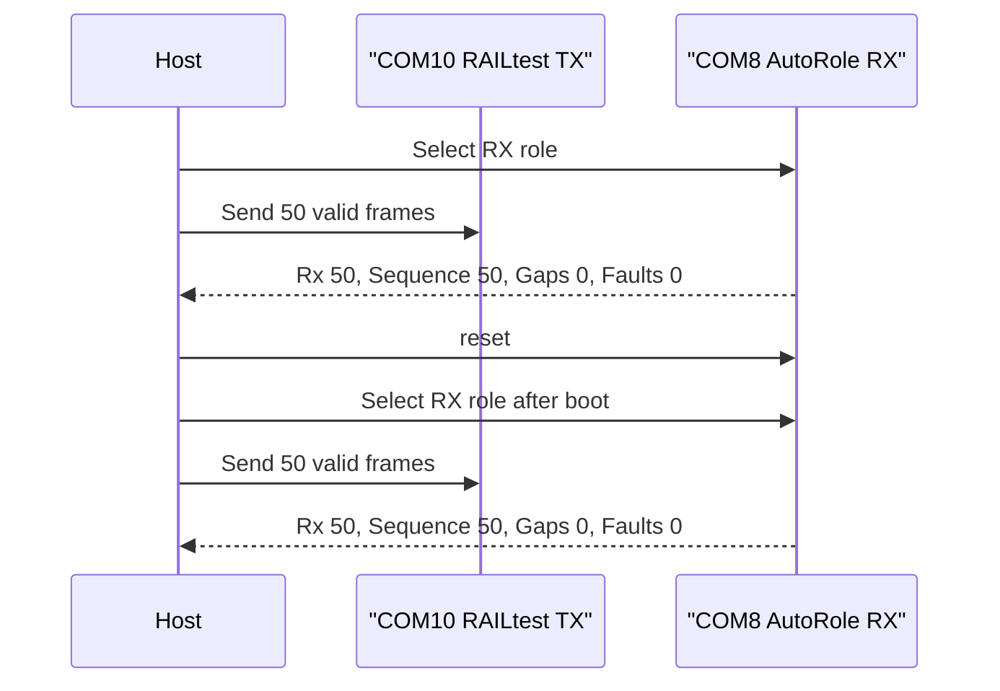

# 20260807 OpenRef Forced Reset Result

**Date:** 2026-08-07  
**Bench:** 2x FG23-DK2600A, RF path 0, antennas attached  
**Scope:** E0-06 forced-reset recovery precheck

## Result

Passed. COM8 accepted a 50-frame valid burst, was explicitly reset, then
accepted another 50-frame burst after AutoRole RX was reselected. Both phases
completed with no OpenRef gaps/faults and no RAIL RX overflow/buffer counters.



## Command

```powershell
python tools\openref_forced_reset_probe.py --rx-port COM8 --tx-port COM10 --rf-path 0 --packets 50 --payload-bytes 60 --command-delay-seconds 0.15 --tx-interval-seconds 0.25 --reset-settle-seconds 3.0 --summary-json firmware\prototype0\fg23\results\20260807-openref-forced-reset-com8-summary.json
```

## Evidence

| Field | Value |
|---|---:|
| Pre-reset pass | true |
| Post-reset pass | true |
| Frames per phase | 50 |
| Post-reset RX count | 50 |
| Post-reset sequence | 50 |
| Post-reset gaps | 0 |
| Post-reset faults | 0 |
| Post-reset RxFifoFull | 0 |
| Post-reset RxOverflow | 0 |
| Post-reset NoRxBuffer | 0 |
| Post-reset FrameErrors | 0 |

## Artifacts

- Summary JSON: `firmware/prototype0/fg23/results/20260807-openref-forced-reset-com8-summary.json`
- Pre-reset summary: `firmware/prototype0/fg23/results/20260807-openref-forced-reset-pre-summary.json`
- Post-reset summary: `firmware/prototype0/fg23/results/20260807-openref-forced-reset-post-summary.json`
- Post-reset RX log: `firmware/prototype0/fg23/results/20260807-230543-openref-queue-pressure-com8-rx.log`
- Post-reset TX log: `firmware/prototype0/fg23/results/20260807-230543-openref-queue-pressure-com10-tx.log`

## Notes

An earlier 25-frame attempt was rejected as harness evidence because the TX
side only completed 24 transmissions and AutoRX reports every 25 frames unless
a gap occurs. The passing run used 50 frames and slower command pacing.
