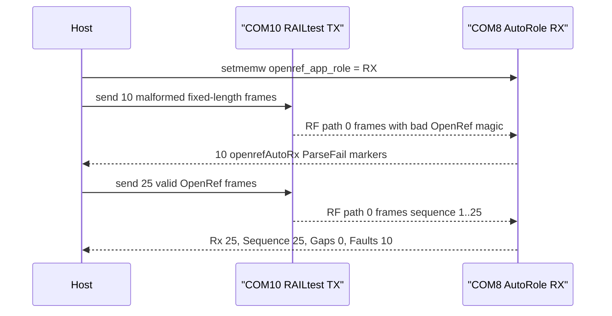

# 20260807 OpenRef Malformed RX Recovery Result

**Date:** 2026-08-07  
**Bench:** 2x FG23-DK2600A, RF path 0, antennas attached  
**Scope:** E0-06 malformed-packet recovery precheck

## Result

Passed. The AutoRole RX board counted every malformed OpenRef frame as a parser
fault, then accepted a valid recovery burst with no sequence gaps.



## Command

```powershell
python tools\openref_malformed_rx_probe.py --rx-port COM8 --tx-port COM10 --rf-path 0 --malformed-packets 10 --recovery-packets 25 --payload-bytes 60 --command-delay-seconds 0.20 --tx-interval-seconds 0.35 --summary-json firmware\prototype0\fg23\results\20260807-openref-malformed-rx-com8-summary.json
```

## Evidence

| Field | Value |
|---|---:|
| Malformed frames requested | 10 |
| Parser-fail markers observed | 10 |
| Valid recovery frames requested | 25 |
| Last RX count | 25 |
| Last valid sequence | 25 |
| Sequence gaps | 0 |
| Fault counter | 10 |
| Pass | true |

## Artifacts

- Summary JSON: `firmware/prototype0/fg23/results/20260807-openref-malformed-rx-com8-summary.json`
- RX log: `firmware/prototype0/fg23/results/20260807-225635-openref-malformed-com8-rx.log`
- TX log: `firmware/prototype0/fg23/results/20260807-225635-openref-malformed-com10-tx.log`

## Notes

An earlier run sent commands too quickly for the RAILtest serial command
interpreter and produced `Input buffer is FULL` on the TX console. The passing
run used slower command pacing so the result reflects firmware/parser behavior,
not host-side command loss.

This closes the malformed-packet portion of E0-06. Queue saturation, forced
reset recovery, and memory-watermark checks remain separate E0-06 work items.
