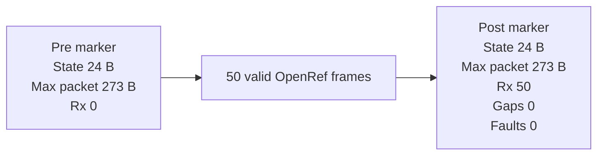

# 20260807 OpenRef Memory Watermark Result

**Date:** 2026-08-07  
**Bench:** 2x FG23-DK2600A, RF path 0, antennas attached  
**Scope:** E0-06 memory-watermark precheck

## Result

Passed. COM8 ran the AutoRole RX path and emitted fixed OpenRef memory markers
before and after a 50-frame valid packet burst. The reported OpenRef state
footprint and maximum packet scratch size were unchanged, and the RX counters
remained clean.



## Command

```powershell
python tools\openref_memory_watermark_probe.py --rx-port COM8 --tx-port COM10 --rf-path 0 --packets 50 --payload-bytes 60 --command-delay-seconds 0.15 --tx-interval-seconds 0.25 --summary-json firmware\prototype0\fg23\results\20260807-openref-memory-watermark-com8-summary.json
```

## Evidence

| Field | Pre | Post |
|---|---:|---:|
| OpenRef state bytes | 24 | 24 |
| Max packet scratch bytes | 273 | 273 |
| RX count | 0 | 50 |
| Sequence gaps | 0 | 0 |
| Faults | 0 | 0 |

RAIL RX status counters after the run:

| Counter | Value |
|---|---:|
| RxFifoFull | 0 |
| RxOverflow | 0 |
| NoRxBuffer | 0 |
| FrameErrors | 0 |

## Artifacts

- Summary JSON: `firmware/prototype0/fg23/results/20260807-openref-memory-watermark-com8-summary.json`
- RX log: `firmware/prototype0/fg23/results/20260807-231105-openref-memory-watermark-com8-rx.log`
- TX log: `firmware/prototype0/fg23/results/20260807-231105-openref-memory-watermark-com10-tx.log`

## Notes

This precheck proves the current OpenRef packet-pair runtime uses a fixed static
state footprint and fixed maximum stack packet scratch size under the tested
traffic pattern. It is not a general heap profiler for future product firmware.
The current OpenRef runtime path does not allocate heap memory.
