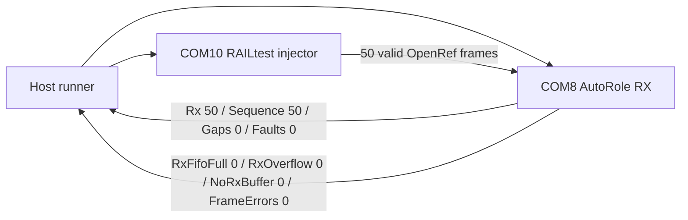

# 20260807 OpenRef Queue Pressure Result

**Date:** 2026-08-07  
**Bench:** 2x FG23-DK2600A, RF path 0, antennas attached  
**Scope:** E0-06 queue-pressure precheck

## Result

Passed. COM8 ran the AutoRole RX path while COM10 injected 50 valid OpenRef
frames through RAILtest. The RX board reported a complete contiguous sequence
with no OpenRef faults and no RAIL RX buffer/overflow counters.



## Command

```powershell
python tools\openref_queue_pressure_probe.py --rx-port COM8 --tx-port COM10 --rf-path 0 --packets 50 --payload-bytes 60 --command-delay-seconds 0.12 --tx-interval-seconds 0.20 --summary-json firmware\prototype0\fg23\results\20260807-openref-queue-pressure-com8-summary.json
```

## Evidence

| Field | Value |
|---|---:|
| Valid frames requested | 50 |
| Last RX count | 50 |
| Last valid sequence | 50 |
| Sequence gaps | 0 |
| OpenRef faults | 0 |
| RxFifoFull | 0 |
| RxOverflow | 0 |
| NoRxBuffer | 0 |
| FrameErrors | 0 |
| Pass | true |

## Artifacts

- Summary JSON: `firmware/prototype0/fg23/results/20260807-openref-queue-pressure-com8-summary.json`
- RX log: `firmware/prototype0/fg23/results/20260807-230129-openref-queue-pressure-com8-rx.log`
- TX log: `firmware/prototype0/fg23/results/20260807-230129-openref-queue-pressure-com10-tx.log`

## Notes

This is a controlled queue-pressure precheck, not a destructive overflow test.
It validates the current held-packet release path under a valid packet burst.
Deeper saturation still needs an intentionally overloaded TX source or firmware
mode that can generate valid sequenced packets faster than the host-driven
RAILtest injector.
