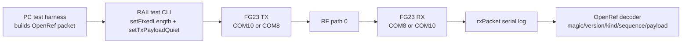

# 20260807 OpenRef Wire Format over RAILtest Result

**Date:** 2026-08-07  
**Boards:** 2x FG23-DK2600A / BRD2600A rev A03  
**Firmware on boards:** Silicon Labs RAILtest, using fixed-length packets  
**RF path:** 0  
**Antennas:** attached

## What This Test Proves



This proves the current OpenRef prototype packet header and payload can be
loaded into the FG23 RAILtest transmit FIFO, sent over the real radio link, read
from the receiver's RAILtest `rxPacket` output, and decoded back into monotonic
OpenRef sequence numbers.

It does **not** yet prove the standalone OpenRef FG23 runtime loop. That still
requires replacing the generated empty `app.c` hook with an OpenRef app entry
point and a Silicon Labs radio adapter.

## Commands

COM8 receive / COM10 transmit:

```powershell
python tools\railtest_openref_packet_run.py --rx-port COM8 --tx-port COM10 --rf-path 0 --packets 50 --payload-bytes 60 --interval-seconds 0.35 --command-delay-seconds 0.15 --settle-seconds 1.5 --summary-json firmware\prototype0\fg23\results\20260807-openref-railtest-com8-rx-50-summary.json
```

COM10 receive / COM8 transmit:

```powershell
python tools\railtest_openref_packet_run.py --rx-port COM10 --tx-port COM8 --rf-path 0 --packets 50 --payload-bytes 60 --interval-seconds 0.35 --command-delay-seconds 0.15 --settle-seconds 1.5 --summary-json firmware\prototype0\fg23\results\20260807-openref-railtest-com10-rx-50-summary.json
```

## Results

| Direction | Requested | Decoded OpenRef packets | Unique sequences | Missing sequences | Duplicate sequences | Result |
|---|---:|---:|---:|---:|---:|---|
| COM10 -> COM8 | 50 | 50 | 50 | 0 | 0 | Pass |
| COM8 -> COM10 | 50 | 50 | 50 | 0 | 0 | Pass |

Packet shape:

| Field | Value |
|---|---|
| Header bytes | 18 |
| Payload bytes | 60 |
| Total packet bytes | 78 |
| Magic | `RO` |
| Version | `1` |
| Kind | `PING` |
| Source/destination | `1 -> 2` in packet payload metadata |

## Evidence Files

| Evidence | Path |
|---|---|
| COM8 RX summary | `firmware/prototype0/fg23/results/20260807-openref-railtest-com8-rx-50-summary.json` |
| COM10 RX summary | `firmware/prototype0/fg23/results/20260807-openref-railtest-com10-rx-50-summary.json` |
| COM8 RX raw log | `firmware/prototype0/fg23/results/20260807-204526-railtest-openref-com8-rx.log` |
| COM10 TX raw log | `firmware/prototype0/fg23/results/20260807-204526-railtest-openref-com10-tx.log` |
| COM10 RX raw log | `firmware/prototype0/fg23/results/20260807-204638-railtest-openref-com10-rx.log` |
| COM8 TX raw log | `firmware/prototype0/fg23/results/20260807-204638-railtest-openref-com8-tx.log` |

## Notes

- `setFixedLength 78` is required. Without it, the active PHY/RAILtest
  length-field behavior truncated received packets to 16 bytes.
- CLI pacing matters. The reliable settings used here were
  `--command-delay-seconds 0.15` and `--interval-seconds 0.35`.
- This is stronger than the earlier vendor packet precheck because the RF frame
  payload is now the OpenRef wire-format packet, not RAILtest's default packet.
