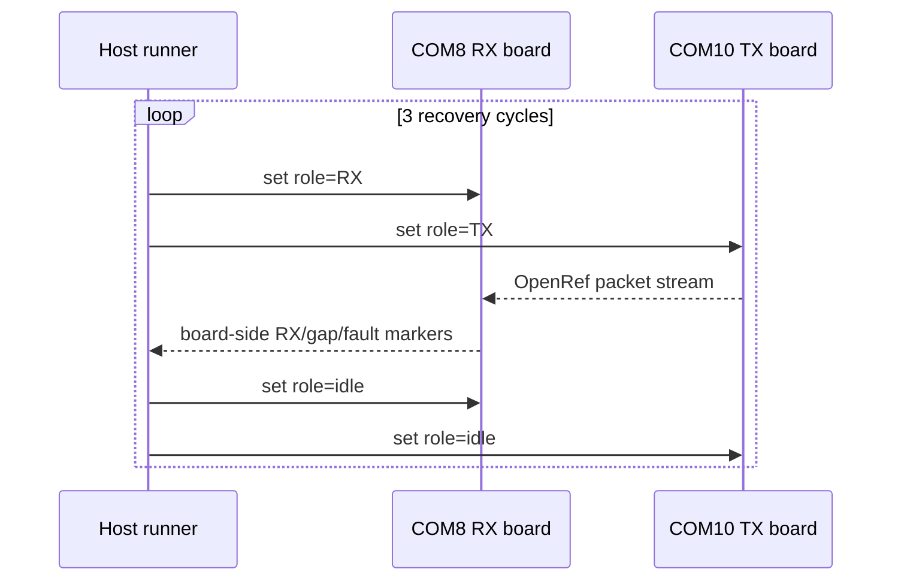

# 20260807 OpenRef Recovery Precheck Result

**Date:** 2026-08-07  
**RX board:** COM8 / SEGGER `440320955`  
**TX board:** COM10 / SEGGER `440320878`  
**RF path:** default/path 0 bench path  
**Image:** shared OpenRef AutoRole image

## Test Shape



This precheck exercises the OpenRef AutoRole transition path that calls
`RAIL_Idle`, resets packet-pair state, and restarts TX/RX roles. It is stronger
than the earlier vendor-only cancellation probe because OpenRef packet
generation and board-side parsing are active in every cycle.

## Command

```powershell
python tools\openref_autorole_recovery_probe.py --rx-port COM8 --tx-port COM10 --rf-path 0 --cycles 3 --duration-seconds 30 --expected-rx 50 --payload-bytes 60
```

## Results

| Cycle | Duration | Payload bytes | Expected RX | Last RX | Last sequence | Gaps | Faults | Result |
|---:|---:|---:|---:|---:|---:|---:|---:|---|
| 1 | 30 s | 60 | 50 | 75 | 75 | 0 | 0 | Pass |
| 2 | 30 s | 60 | 50 | 75 | 75 | 0 | 0 | Pass |
| 3 | 30 s | 60 | 50 | 75 | 75 | 0 | 0 | Pass |

Evidence:

| Evidence | Path |
|---|---|
| Aggregate summary JSON | `firmware/prototype0/fg23/results/20260807-openref-autorole-recovery-summary.json` |
| Cycle 1 RX log | `firmware/prototype0/fg23/results/20260807-223921-openref-autorole-com8-rx.log` |
| Cycle 2 RX log | `firmware/prototype0/fg23/results/20260807-223954-openref-autorole-com8-rx.log` |
| Cycle 3 RX log | `firmware/prototype0/fg23/results/20260807-224027-openref-autorole-com8-rx.log` |

## Bench Restore

After the recovery probe, the normal non-AutoTX/non-AutoRX/non-AutoRole OpenRef
hook image was rebuilt and flashed back to both boards. A RAILtest smoke test
passed after restore.

## Remaining Gap

E0-06 now has an OpenRef role-cycle recovery precheck. Remaining fault work
requires a more intrusive harness for malformed packets, queue saturation,
forced reset, and memory-watermark evidence.
