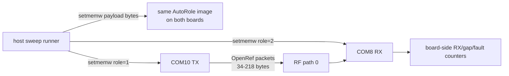

# 20260807 OpenRef Runtime Capacity Sweep Result

**Date:** 2026-08-07  
**RX board:** COM8 / SEGGER `440320955`  
**TX board:** COM10 / SEGGER `440320878`  
**RF path:** default/path 0 bench path  
**Image:** shared OpenRef AutoRole image with runtime payload-length control

## Test Shape



The sweep uses the OpenRef packet builder and board-owned RX parser/counters,
not the vendor RAILtest packet generator. The host only selects test parameters
through RAILtest `setmemw`.

## Command

```powershell
python tools\openref_autorole_capacity_sweep.py --rx-port COM8 --tx-port COM10 --rf-path 0 --payloads 16 60 120 200 --duration-seconds 60 --expected-rx 120
```

## Results

| Payload bytes | Packet bytes | Duration | Expected RX | Last RX | Last sequence | Gaps | Faults | Result |
|---:|---:|---:|---:|---:|---:|---:|---:|---|
| 16 | 34 | 60 s | 120 | 150 | 150 | 0 | 0 | Pass |
| 60 | 78 | 60 s | 120 | 150 | 150 | 0 | 0 | Pass |
| 120 | 138 | 60 s | 120 | 150 | 150 | 0 | 0 | Pass |
| 200 | 218 | 60 s | 120 | 150 | 150 | 0 | 0 | Pass |

Evidence:

| Evidence | Path |
|---|---|
| Aggregate summary JSON | `firmware/prototype0/fg23/results/20260807-openref-autorole-capacity-sweep-summary.json` |
| 16-byte RX log | `firmware/prototype0/fg23/results/20260807-223155-openref-autorole-com8-rx.log` |
| 60-byte RX log | `firmware/prototype0/fg23/results/20260807-223258-openref-autorole-com8-rx.log` |
| 120-byte RX log | `firmware/prototype0/fg23/results/20260807-223401-openref-autorole-com8-rx.log` |
| 200-byte RX log | `firmware/prototype0/fg23/results/20260807-223505-openref-autorole-com8-rx.log` |

## Bench Restore

After the sweep, the normal non-AutoTX/non-AutoRX/non-AutoRole OpenRef hook
image was rebuilt and flashed back to both boards. A RAILtest smoke test passed
after restore.

## Interpretation

E0-04 is now passed for the current bench range: OpenRef runtime packets from
34 to 218 total bytes crossed RF path 0 with board-side parsing, no sequence
gaps, and no parser/radio faults. This does not replace later RF margin testing
under controlled attenuation.
