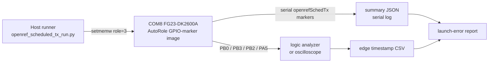

# 20260807 OpenRef Scheduled TX GPIO Marker Plan

**Date:** 2026-08-07  
**Board:** FG23-DK2600A / BRD2600A rev A03  
**Gate:** E0-03 scheduled transmission timing

## Purpose

The OpenRef scheduled-TX SDK timestamp precheck passed, but E0-03 still needs
an external timing instrument. This plan pins the optional firmware GPIO marker
hooks to reachable BRD2600A breakout pads so a logic analyzer or oscilloscope
can measure launch timing directly.



## Marker Assignment

| Marker | Firmware define | BRD2600A pad | Shared board function | Use |
|---|---|---|---|---|
| Packet built | `OPENREF_GPIO_BUILD_*` | `PB0` | LC sensor excite | Optional pre-queue reference |
| Scheduled TX queued | `OPENREF_GPIO_QUEUE_*` | `PB3` | LC sensor sense | Primary queue edge |
| TX started | `OPENREF_GPIO_START_*` | `PB2` | LED0 | Primary start edge |
| TX done | `OPENREF_GPIO_DONE_*` | `PA5` | BTN1 | Completion edge, if a fourth channel is useful |

The preferred minimal capture is `PB3` queue and `PB2` start. Add `PB0` and
`PA5` when four analyzer channels are available.

Avoid these pins for marker output on this bench:

| Pins | Reason |
|---|---|
| `PA9`, `PA10` | VCOM serial TX/RX |
| `PA1`, `PA2`, `PA3` | SWCLK/SWDIO/SWO debug path |
| `PC2`, `PC3` | PTI frame/data |
| `PA7`, `PA8` | Si7021 I2C sensor |
| `PB1` | BTN0 and bootloader activation |

Sources used for the pin selection:

- Silicon Labs FG23-DK2600A kit page: <https://www.silabs.com/development-tools/wireless/proprietary/efr32fg23-868-915-mhz-14-dbm-dev-kit>
- Silicon Labs UG508 BRD2600A user guide mirror with breakout and Mini Simplicity pin tables: <https://device.report/m/0e5450f9071d3017710ad39929b30a493d0e0c9dcdd5eefe369f5dd9729a5204_pdf>
- Local generated board config files under the Simplicity SDK project confirmed VCOM, PTI, LED, button, and Si7021 pin ownership.

## Build Command

Install the opt-in AutoRole GPIO-marker overlay:

```powershell
powershell -ExecutionPolicy Bypass -File H:\Documents\GitHub\openref\tools\install_openref_fg23_overlay.ps1 -InstallAppShim -EnableAutoRole -BuildMarker B0 -QueueMarker B3 -StartMarker B2 -DoneMarker A5
```

Then rebuild the generated Simplicity project:

```powershell
$env:PATH='C:\Users\aliel\.silabs\slt\installs\conan\p\cmakefa35ab0687064\p\bin;C:\Users\aliel\.silabs\slt\installs\conan\p\ninja1a38fc85adcf7\p;' + $env:PATH
cd C:\Users\aliel\SimplicityStudio\v6_workspace\rail_soc_railtest\cmake_gcc
cmake --workflow --preset project
```

Flash COM8 only for the timing capture:

```powershell
& 'C:\Users\aliel\.silabs\slt\installs\archive\Simplicity Commander\commander.exe' flash 'C:\Users\aliel\SimplicityStudio\v6_workspace\rail_soc_railtest\cmake_gcc\build\base\rail_soc_railtest.hex' --serialno 440320955
```

After the capture, reinstall and rebuild the normal overlay, then reflash the
normal image to COM8.

## Capture Procedure

Before wiring the fixture, generate and fill a readiness file:

```powershell
python tools\prototype0_fixture_readiness.py --gate E0-03 --template --json firmware\prototype0\fg23\results\YYYYMMDD-e0-03-readiness.json
python tools\prototype0_fixture_readiness.py --gate E0-03 --check firmware\prototype0\fg23\results\YYYYMMDD-e0-03-readiness.json
python tools\run_prototype0_fixture_analysis.py --readiness firmware\prototype0\fg23\results\YYYYMMDD-e0-03-readiness.json --dry-run
```

1. Connect analyzer ground to board ground.
2. Connect analyzer channels to `PB3` and `PB2`; optionally add `PB0` and
   `PA5`.
3. Sample at 5 MHz or faster. The marker pulses are short firmware pulses.
4. Run:

```powershell
python tools\openref_scheduled_tx_run.py --port COM8 --rf-path 0 --attempts 100 --payload-bytes 60 --timeout-seconds 20 --summary-json firmware\prototype0\fg23\results\YYYYMMDD-openref-scheduled-tx-gpio-com8-summary.json
```

5. Export analyzer edges to CSV as
   `firmware/prototype0/fg23/results/YYYYMMDD-e0-03-scheduled-tx-gpio.csv`.
6. Run the readiness-driven analyzer:

```powershell
python tools\run_prototype0_fixture_analysis.py --readiness firmware\prototype0\fg23\results\YYYYMMDD-e0-03-readiness.json --json firmware\prototype0\fg23\results\YYYYMMDD-e0-03-run-report.json
```

This invokes the strict queue/start edge analyzer from the readiness metadata.
The underlying analyzer command shape is:

```powershell
python tools\analyze_scheduled_tx_gpio.py firmware\prototype0\fg23\results\YYYYMMDD-e0-03-scheduled-tx-gpio.csv --queue-channel PB3 --start-channel PB2 --expected-samples 100 --fail-on-unpaired-edges --json firmware\prototype0\fg23\results\YYYYMMDD-e0-03-scheduled-tx-gpio.summary.json
```

7. Compare the GPIO summary with serial `RequestedUs` / `StartUs` from
   `openref_scheduled_tx_run.py`.

The analyzer accepts two common CSV shapes:

| CSV shape | Required columns | Notes |
|---|---|---|
| Edge list | time column, channel column, optional value/state column | Examples: `Time [s],Channel,Value`; rising edges are selected when value/state is present |
| Sampled digital columns | time column plus columns named for each marker | Examples: `time_s,PB3,PB2`; rising transitions are inferred from 0-to-1 samples |

The analyzer reports `orphan_start_edges`, `unpaired_queue_edges`, and
`extra_start_edges`. Use `--fail-on-unpaired-edges` for final E0-03 evidence so
logic-analyzer noise, marker bounce, or missing marker pulses cannot be hidden
by a superficially adequate sample count.

## Pass/Fail Interpretation

E0-03 can be called complete only after the external capture produces at least
100 scheduled-TX samples with queue and start edges. The result must report
launch error min, mean, p95, p99, and max, and must leave enough guard for the
six-node 20 ms slot schedule.
