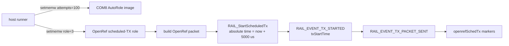

# 20260807 OpenRef Scheduled TX SDK-Timestamp Result

**Date:** 2026-08-07  
**TX board:** COM8 / SEGGER `440320955`  
**RF path:** path 0 selected before test  
**Image:** shared OpenRef AutoRole image with scheduled-TX role `3`  
**Packet:** OpenRef prototype packet, 18-byte header + 60-byte payload = 78 bytes

## Test Shape



This is an SDK timestamp precheck for E0-03. It verifies that OpenRef firmware
can schedule 100 transmissions and recover the RAIL TX-start timestamp for each
attempt. It does not replace the final external GPIO/logic-analyzer measurement.

## Command

```powershell
python tools\openref_scheduled_tx_run.py --port COM8 --rf-path 0 --attempts 100 --payload-bytes 60 --timeout-seconds 20 --summary-json firmware\prototype0\fg23\results\20260807-openref-scheduled-tx-com8-summary.json
```

## Results

| Metric | Value |
|---|---:|
| Scheduled attempts | 100 |
| Accepted attempts | 100 |
| Rejected attempts | 0 |
| Queued markers | 100 |
| TX-start markers | 100 |
| TX-done markers | 100 |
| Launch error min us | -3 |
| Launch error mean us | 3.93 |
| Launch error p95 us | 4.0 |
| Launch error p99 us | 4.0 |
| Launch error max us | 4 |

Evidence:

| Evidence | Path |
|---|---|
| Summary JSON | `firmware/prototype0/fg23/results/20260807-openref-scheduled-tx-com8-summary.json` |
| Raw serial log | `firmware/prototype0/fg23/results/20260807-224726-openref-scheduled-tx-com8.log` |

## Bench Restore

After evidence capture, the normal non-AutoTX/non-AutoRX/non-AutoRole OpenRef
hook image was rebuilt and flashed back to COM8. A two-board RAILtest smoke
test passed after restore.

## Remaining Gap

E0-03 still requires external timing capture. The firmware now has optional
GPIO marker hooks for build, queue, TX-start, and TX-done. The BRD2600A marker
pin plan is documented in
`20260807-openref-scheduled-tx-gpio-marker-plan.md`; the remaining external
work is flashing that opt-in marker image, wiring the logic analyzer or
oscilloscope, and capturing at least 100 queue/start edge pairs.
