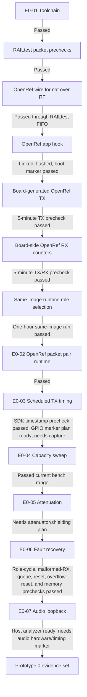

# 20260807 Prototype 0 Gate Status

**Date:** 2026-08-07  
**Scope:** Current two-board FG23-DK2600A bench setup

## Gate Map

## Status

| Gate | Current status | Evidence |
|---|---|---|
| E0-01 Toolchain reproduction | Passed | `20260807-e0-01-link-smoke-result.md` |
| RAILtest link smoke | Passed | RF path 0, antennas attached, packet exchange both directions; latest medium retention check passed 200/200 in both directions with zero CRC drops: `20260808-railtest-bidirectional-retention-result.md` |
| E0-02 Continuous packet pair | Passed on bench: vendor packet prechecks passed; OpenRef wire format over RF passed; OpenRef app hook built/flashed/booted; board-owned AutoTX/AutoRX 5-minute prechecks passed; same-image AutoRole one-hour run passed with 10275 RX, 0 gaps, 0 faults | `20260807-railtest-packet-precheck-result.md`, `20260807-railtest-1500pkt-20ms-result.md`, `20260807-openref-railtest-wire-format-result.md`, `20260807-openref-app-hook-result.md`, `20260807-openref-autotx-result.md`, `20260807-openref-autorx-result.md`, `20260807-openref-autorole-result.md` |
| E0-03 Scheduled transmission | Vendor API-path precheck passed; OpenRef SDK-timestamp precheck passed with 100/100 scheduled TX starts and p99 launch error 4 us; opt-in BRD2600A GPIO marker build/pin plan prepared; external GPIO/logic-analyzer capture pending | `20260807-railtest-scheduled-tx-precheck-result.md`, `20260807-openref-scheduled-tx-sdk-result.md`, `20260807-openref-scheduled-tx-gpio-marker-plan.md` |
| E0-04 Payload capacity sweep | Passed on current bench range: vendor short sweep passed; OpenRef runtime AutoRole sweep passed 16/60/120/200 payload bytes with 150 RX each, 0 gaps, 0 faults | `20260807-railtest-capacity-precheck-result.md`, `20260807-openref-railtest-wire-format-result.md`, `20260807-openref-runtime-capacity-result.md` |
| E0-05 Controlled attenuation | Host analysis workflow prepared; bidirectional TX-power link-margin precheck passed with COM10 TX requested 14/0/-10 dBm, board-reported 14.0/-0.4/-11.1 dBm, and COM8 TX requested 10/0/-10 dBm, board-reported 10.0/-0.4/-11.1 dBm, with 50/50 packets at every step; RF path 0 RSSI tone precheck passed in both directions with +71.5 dB and +64.5 dB deltas; RF path 1 expected-negative RSSI precheck stayed below the +10 dB tone threshold, so path 0 remains the qualified bench path; blocked on attenuation/shielding setup | `20260807-openref-attenuation-analysis-plan.md`, `20260808-railtest-tx-power-sweep-precheck-result.md`, `20260808-railtest-rssi-path0-precheck-result.md`, `20260808-railtest-rssi-path1-negative-precheck-result.md`; requires controlled RF attenuation or reproducible shielding method |
| E0-06 Radio fault recovery | Safe vendor cancellation precheck passed; OpenRef role-cycle recovery precheck passed; malformed-packet recovery precheck passed; queue-pressure precheck passed; forced-reset recovery precheck passed; vendor RX-overflow reset-recovery precheck passed; fixed-footprint memory-watermark precheck passed; no-reset RX-overflow recovery remains a product-firmware policy gap | `20260807-railtest-fault-precheck-result.md`, `20260807-openref-recovery-precheck-result.md`, `20260807-openref-malformed-rx-result.md`, `20260807-openref-queue-pressure-result.md`, `20260807-openref-forced-reset-result.md`, `20260808-railtest-rx-overflow-reset-recovery-result.md`, `20260807-openref-memory-watermark-result.md` |
| E0-07 Audio loopback timing | Host analysis workflow prepared; blocked on audio pipeline hardware/firmware | `20260807-openref-audio-loopback-analysis-plan.md`; requires capture/playback path and timing marker |

## Next Autonomous Work

0. Run `python tools/audit_prototype0_gates.py` after each new gate result to
   verify that the evidence map, readiness state, analyzer inputs, analyzer
   summary, fixture runner report, and blocker list still match the current worktree. Include
   `--mermaid firmware/prototype0/fg23/results/YYYYMMDD-prototype0-gate-audit.mmd`
   when a visual gate map is useful.
   Use `python tools/prototype0_status_run.py --pytest --power-check --packet-smoke --packet-bidirectional` when a single
   repeatable status run should include fixture analyzer discovery/dry-runs,
   the simulator/tools test suite, low-impact board `getPower` checks, and a
   short bidirectional RF path 0 packet smoke.
1. For E0-03, E0-05, or E0-07, generate a filled readiness file with
   `tools/prototype0_fixture_readiness.py --fill`, then run
   `tools/run_prototype0_fixture_analysis.py --dry-run` to verify the exact
   analyzer command and required capture inputs before collecting fixture data.
2. Flash the opt-in E0-03 GPIO-marker image and capture `PB3` queue plus `PB2` start edges with a logic analyzer or scope.
3. Decide OpenRef product policy for RX-overflow recovery: automatic radio recovery, radio reset, or full device reset.
4. Run E0-05 packet checks at baseline plus attenuated/shielded steps, then execute the filled readiness file with `tools/run_prototype0_fixture_analysis.py`.
5. Implement an audio fixture/firmware marker path, then execute the filled E0-07 readiness file with `tools/run_prototype0_fixture_analysis.py`.

## External Inputs Needed Later

- Logic analyzer or oscilloscope for E0-03 launch variation.
- Attenuator, RF shield box, controlled distance method, or repeatable body
  shielding setup for E0-05.
- Audio loopback fixtures for E0-07.
