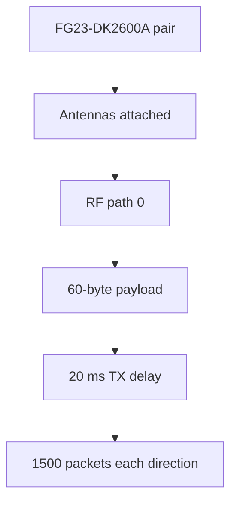

# 20260807 RAILtest 1500-Packet 20 ms Result

**Date:** 2026-08-07  
**Status:** Pass by RAILtest counters; serial notification capture is incomplete

## Test Shape



## Commands

| Direction | Command | Result |
|---|---|---|
| COM10 -> COM8 | `python tools\railtest_packet_run.py --packets 1500 --payload-bytes 60 --tx-delay-ms 20 --settle-seconds 35 --rf-path 0 --summary-json firmware\prototype0\fg23\results\20260807-railtest-1500pkt-20ms-com8-rx.json` | Pass |
| COM8 -> COM10 | `python tools\railtest_packet_run.py --rx-port COM10 --tx-port COM8 --packets 1500 --payload-bytes 60 --tx-delay-ms 20 --settle-seconds 35 --rf-path 0 --summary-json firmware\prototype0\fg23\results\20260807-railtest-1500pkt-20ms-com10-rx.json` | Pass |

## RAILtest Counter Metrics

| Direction | TX complete | RX count | Sync detect | CRC drops | Delivery ratio |
|---|---:|---:|---:|---:|---:|
| COM10 -> COM8 | 1500 | 1500 | 1500 | 0 | 1.0 |
| COM8 -> COM10 | 1500 | 1500 | 1500 | 0 | 1.0 |

## Analyzer Bridge

The latest RX serial notification log was converted with:

```powershell
python tools\railtest_to_packet_csv.py firmware\prototype0\fg23\results\20260807-railtest-pair-rx.log --output firmware\prototype0\fg23\results\20260807-railtest-1500pkt-20ms.csv
python tools\analyze_packet_pair.py firmware\prototype0\fg23\results\20260807-railtest-1500pkt-20ms.csv --json firmware\prototype0\fg23\results\20260807-railtest-1500pkt-20ms-summary.json
```

| Analyzer metric | Value |
|---|---:|
| Converted RX notification lines | 1489 |
| First synthetic sequence | 1 |
| Last synthetic sequence | 1489 |
| Sequence gaps in converted rows | 0 |
| Mean inter-arrival | 20667.91 us |
| P95 inter-arrival | 20669.0 us |
| P99 inter-arrival | 20669.0 us |
| RSSI mean | -27.95 dBm |
| LQI mean | 255.0 |

## Interpretation

The radio path passed the 1500-packet vendor precheck at an E0-02-like interval.
RAILtest status counters are the authoritative result for this vendor precheck:
both directions reported 1500 received packets, 1500 sync detects, and zero CRC
drops.

The serial notification stream is not sufficient as the sole evidence source at
this packet rate. The latest converted log contained 1489 `rxPacket` lines even
though RAILtest counters reported 1500 received packets. OpenRef-owned firmware
must use structured logging designed for the target packet rate, preferably
logging compact CSV rows and counters rather than verbose RAILtest notification
objects.

## Decision

Proceed with OpenRef-owned E0-02 firmware. Keep the RAILtest 1500-packet run as
a vendor precheck, not as the final E0-02 result.
