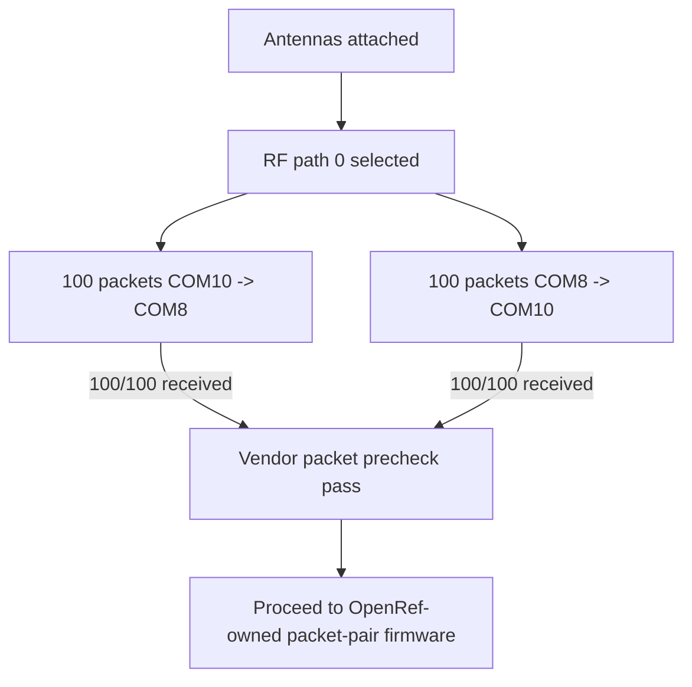

# 20260807 RAILtest Packet Precheck Result

**Date:** 2026-08-07  
**Status:** Pass as vendor-firmware packet precheck; not a substitute for E0-02

## Result Flow



## Commands

| Direction | Command | Result |
|---|---|---|
| COM8 receiver, COM10 transmitter | `python tools\railtest_packet_run.py --packets 100 --payload-bytes 60 --settle-seconds 30 --rf-path 0 --summary-json firmware\prototype0\fg23\results\20260807-railtest-packet-run-com8-rx.json` | Pass |
| COM10 receiver, COM8 transmitter | `python tools\railtest_packet_run.py --rx-port COM10 --tx-port COM8 --packets 100 --payload-bytes 60 --settle-seconds 30 --rf-path 0 --summary-json firmware\prototype0\fg23\results\20260807-railtest-packet-run-com10-rx.json` | Pass |

## Metrics

| Direction | Requested | TX complete | RX count | Sync detect | CRC drops | Delivery ratio |
|---|---:|---:|---:|---:|---:|---:|
| COM10 -> COM8 | 100 | 100 | 100 | 100 | 0 | 1.0 |
| COM8 -> COM10 | 100 | 100 | 100 | 100 | 0 | 1.0 |

## Analyzer Bridge

The latest RAILtest RX log was converted into the OpenRef packet analyzer CSV
shape:

```powershell
python tools\railtest_to_packet_csv.py firmware\prototype0\fg23\results\20260807-railtest-pair-rx.log --output firmware\prototype0\fg23\results\20260807-railtest-packet-run.csv
python tools\analyze_packet_pair.py firmware\prototype0\fg23\results\20260807-railtest-packet-run.csv --json firmware\prototype0\fg23\results\20260807-railtest-packet-run-summary.json
```

Analyzer output from the converted vendor log:

| Metric | Value |
|---|---:|
| Received packets | 100 |
| First sequence | 1 |
| Last sequence | 100 |
| Sequence gaps | 0 |
| RX gap events | 0 |
| Fault events | 0 |
| Inter-arrival mean | 250687.34 us |
| Inter-arrival p95 | 250688.0 us |
| RSSI mean | -27.92 dBm |
| LQI mean | 255.0 |

## Interpretation

This proves the two boards, antennas, RF path 0, channel 0, and the Silicon Labs
RAILtest packet path are working for a short bench run.

This does not complete E0-02 because the vendor RAILtest packet format does not
yet provide the OpenRef packet header, sequence-numbered payload, analyzer CSV,
or one-hour run required by the Prototype 0 entry tests.

## Next Step

Create OpenRef-owned FG23 packet-pair firmware with:

- `packet_pair_tx` and `packet_pair_rx` roles;
- `openref_proto0_packet_header_t` at the start of each packet;
- sequence numbers and local timestamps;
- structured serial logs compatible with `tools/analyze_packet_pair.py`;
- a short precheck run before the one-hour E0-02 run.
