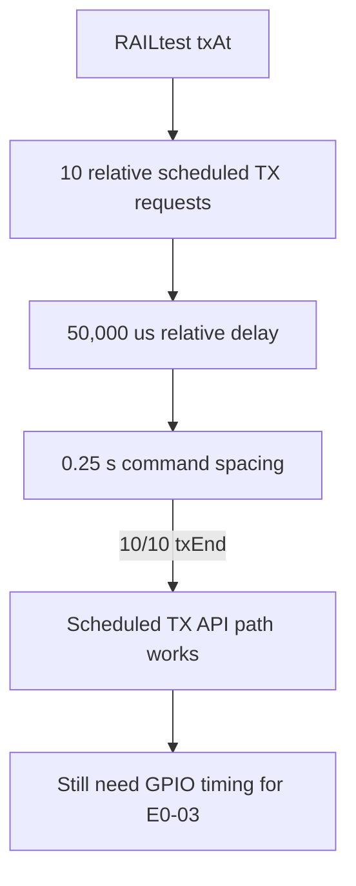

# 20260807 RAILtest Scheduled TX Precheck Result

**Date:** 2026-08-07  
**Status:** Pass as API-path precheck; GPIO timing measurement still required

## Summary



## Command

```powershell
python tools\railtest_scheduled_tx_probe.py --port COM8 --count 10 --relative-delay-us 50000 --spacing-seconds 0.25 --rf-path 0 --summary-json firmware\prototype0\fg23\results\20260807-railtest-scheduled-tx-com8.json
```

## Metrics

| Metric | Value |
|---|---:|
| Requested scheduled TX | 10 |
| TX end events | 10 |
| User TX count | 10 |
| User TX started | 10 |
| User TX aborted | 0 |
| User TX blocked | 0 |
| User TX underflow | 0 |

## Interpretation

RAILtest can issue and complete relative scheduled TX requests on the FG23 board.
This supports proceeding toward E0-03 implementation.

This does not complete E0-03. The E0-03 gate requires measuring actual launch
variation with a GPIO marker or equivalent external timing instrument.
