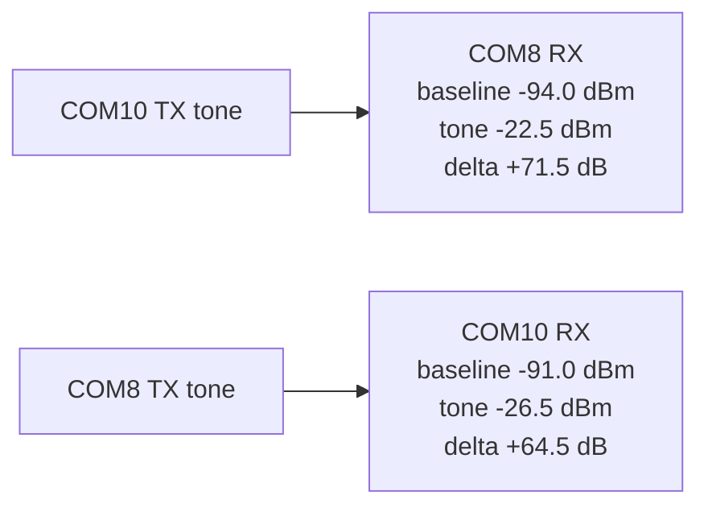

# 20260808 RAILtest RSSI Path 0 Precheck Result

**Date:** 2026-08-08  
**Scope:** RF path 0 health and link-margin precheck, not calibrated attenuation  
**Boards:** COM8 / SEGGER `440320955`; COM10 / SEGGER `440320878`  
**RF path:** path 0

## Result

Passed in both directions. Each receiver saw a clear RSSI increase while the
other board emitted a RAILtest TX tone.



## Commands

```powershell
python tools\railtest_rssi_probe.py --rx-port COM8 --tx-port COM10 --rf-path 0 --summary-json firmware\prototype0\fg23\results\20260808-railtest-rssi-com8-rx-com10-tx-rf0-summary.json
python tools\railtest_rssi_probe.py --rx-port COM10 --tx-port COM8 --rf-path 0 --summary-json firmware\prototype0\fg23\results\20260808-railtest-rssi-com10-rx-com8-tx-rf0-summary.json
```

## Metrics

| RX board | TX board | Baseline RSSI | Tone RSSI | Delta | Minimum delta | Result |
|---|---|---:|---:|---:|---:|---|
| COM8 | COM10 | -94.0 dBm | -22.5 dBm | +71.5 dB | +10.0 dB | Pass |
| COM10 | COM8 | -91.0 dBm | -26.5 dBm | +64.5 dB | +10.0 dB | Pass |

Evidence:

| Evidence | Path |
|---|---|
| COM8 RX / COM10 TX summary JSON | `firmware/prototype0/fg23/results/20260808-railtest-rssi-com8-rx-com10-tx-rf0-summary.json` |
| COM10 RX / COM8 TX summary JSON | `firmware/prototype0/fg23/results/20260808-railtest-rssi-com10-rx-com8-tx-rf0-summary.json` |

## Limitation

This validates that RF path 0 has strong bidirectional tone energy on the
current bench. It does not replace E0-05 controlled attenuation because RSSI
tone delta is not a calibrated packet-loss sweep through known attenuation,
shielding, body loss, or multipath conditions.
