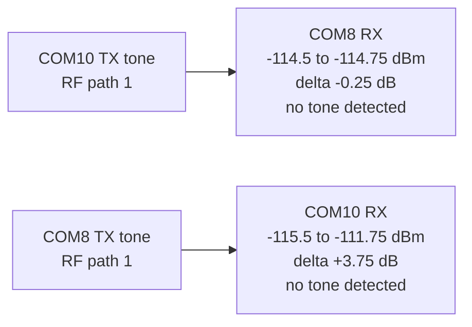

# 20260808 RAILtest RSSI Path 1 Negative Precheck Result

**Date:** 2026-08-08  
**Scope:** Bench RF-path selection check  
**Boards:** COM8 / SEGGER `440320955`; COM10 / SEGGER `440320878`  
**RF path:** path 1

## Result

Passed as an expected negative path-selection check. Both boards stayed near
the noise floor when path 1 was selected and the opposite board emitted a
RAILtest TX tone.



## Commands

```powershell
python tools\railtest_rssi_probe.py --rx-port COM8 --tx-port COM10 --rf-path 1 --expect no-tone --summary-json firmware\prototype0\fg23\results\20260808-railtest-rssi-com8-rx-com10-tx-rf1-summary.json
python tools\railtest_rssi_probe.py --rx-port COM10 --tx-port COM8 --rf-path 1 --expect no-tone --summary-json firmware\prototype0\fg23\results\20260808-railtest-rssi-com10-rx-com8-tx-rf1-summary.json
```

## Metrics

| RX board | TX board | Baseline RSSI | Tone RSSI | Delta | Tone threshold | Expected | Result |
|---|---|---:|---:|---:|---:|---|---|
| COM8 | COM10 | -114.5 dBm | -114.75 dBm | -0.25 dB | +10.0 dB | no tone | Pass |
| COM10 | COM8 | -115.5 dBm | -111.75 dBm | +3.75 dB | +10.0 dB | no tone | Pass |

Evidence:

| Evidence | Path |
|---|---|
| COM8 RX / COM10 TX summary JSON | `firmware/prototype0/fg23/results/20260808-railtest-rssi-com8-rx-com10-tx-rf1-summary.json` |
| COM10 RX / COM8 TX summary JSON | `firmware/prototype0/fg23/results/20260808-railtest-rssi-com10-rx-com8-tx-rf1-summary.json` |

## Interpretation

Use RF path 0 for the current antenna-connected Prototype 0 bench. Path 1 does
not show useful tone energy in this setup and should not be used for packet,
capacity, scheduled-TX, or fault-recovery gate runs unless the RF connection is
changed and requalified.
