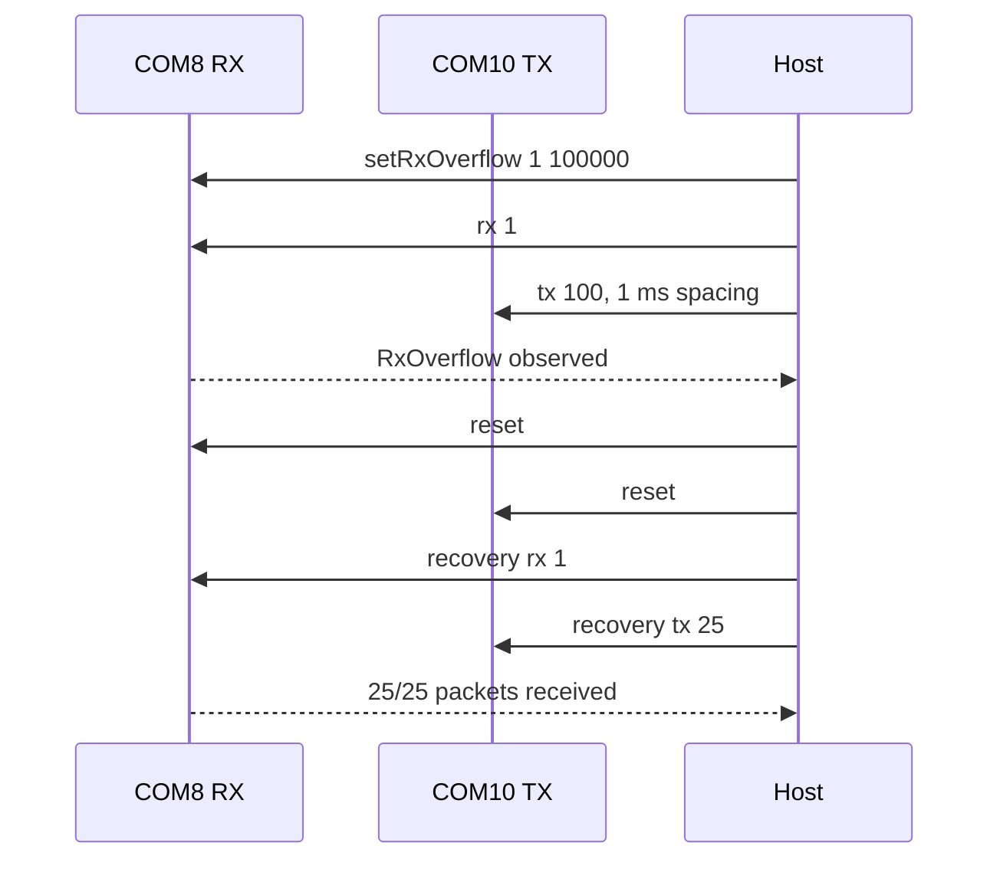

# 20260808 RAILtest RX Overflow Reset-Recovery Result

**Date:** 2026-08-08  
**Scope:** E0-06 destructive RX-overflow recovery precheck  
**Boards:** COM8 / SEGGER `440320955`; COM10 / SEGGER `440320878`  
**RF path:** path 0

## Result

Passed in both directions as a vendor-firmware destructive recovery precheck.
The test used the RAILtest `setRxOverflow` fault-injection command to delay RX
event handling, observed an RX overflow counter, reset both boards, and then
verified normal packet delivery.



## Command

COM8 as RX:

```powershell
python tools\railtest_rx_overflow_recovery_probe.py --rx-port COM8 --tx-port COM10 --rf-path 0 --overflow-delay-us 100000 --stress-packets 100 --stress-tx-delay-ms 1 --recovery-packets 25 --payload-bytes 60 --summary-json firmware\prototype0\fg23\results\20260808-railtest-rx-overflow-reset-recovery-com8-summary.json
```

COM10 as RX:

```powershell
python tools\railtest_rx_overflow_recovery_probe.py --rx-port COM10 --tx-port COM8 --rf-path 0 --overflow-delay-us 100000 --stress-packets 100 --stress-tx-delay-ms 1 --recovery-packets 25 --payload-bytes 60 --summary-json firmware\prototype0\fg23\results\20260808-railtest-rx-overflow-reset-recovery-com10-summary.json
```

## Metrics

| Metric | COM8 RX | COM10 RX |
|---|---:|---:|
| Induced fault observed | true | true |
| Max RxOverflow | 1 | 1 |
| Max NoRxBuffer | 0 | 0 |
| Max FrameErrors | 0 | 0 |
| Reset after overflow | true | true |
| Recovery transmitted packets | 25 | 25 |
| Recovery RX packets | 25 | 25 |
| Recovery delivery ratio | 1.0 | 1.0 |
| Recovery CRC drops | 0 | 0 |

Evidence:

| Evidence | Path |
|---|---|
| COM8 RX summary JSON | `firmware/prototype0/fg23/results/20260808-railtest-rx-overflow-reset-recovery-com8-summary.json` |
| COM8 RX fault-injection RX log | `firmware/prototype0/fg23/results/20260807-233331-railtest-rx-overflow-com8-rx.log` |
| COM8 RX fault-injection TX log | `firmware/prototype0/fg23/results/20260807-233331-railtest-rx-overflow-com10-tx.log` |
| COM8 RX recovery summary | `firmware/prototype0/fg23/results/20260807-233331-railtest-rx-overflow-recovery-summary.json` |
| COM10 RX summary JSON | `firmware/prototype0/fg23/results/20260808-railtest-rx-overflow-reset-recovery-com10-summary.json` |
| COM10 RX fault-injection RX log | `firmware/prototype0/fg23/results/20260807-233531-railtest-rx-overflow-com10-rx.log` |
| COM10 RX fault-injection TX log | `firmware/prototype0/fg23/results/20260807-233531-railtest-rx-overflow-com8-tx.log` |
| COM10 RX recovery summary | `firmware/prototype0/fg23/results/20260807-233531-railtest-rx-overflow-recovery-summary.json` |

## Limitation

A no-reset version of this probe was attempted first and did not recover cleanly
on the RAILtest application: the induced fault left the boards in inconsistent
RAILtest app states and the follow-on packet exchange failed. For this bench,
the safe destructive precheck is therefore reset-recovery after induced RX
overflow, not no-reset recovery.

This is still vendor-firmware evidence. OpenRef product firmware will need a
clear policy for whether RX-overflow recovery is automatic, radio-reset based,
or full device-reset based.
