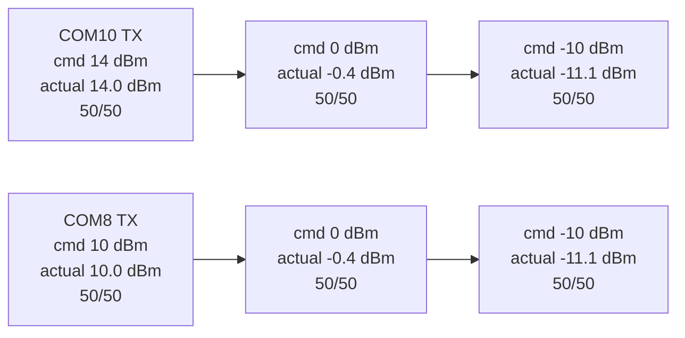

# 20260808 RAILtest TX Power Sweep Precheck Result

**Date:** 2026-08-08  
**Scope:** E0-05 link-margin precheck, not final controlled attenuation  
**Forward direction:** COM8 RX / COM10 TX  
**Reverse direction:** COM10 RX / COM8 TX  
**RF path:** path 0

## Result

Passed as a software-controlled link-margin precheck in both directions. Each
transmitter sent 50 packets at each configured TX power and the opposite board
received all packets at every step. RAILtest `getPower` was queried after each
`setPower` command so the summaries record both requested and board-reported TX
power.



## Command

```powershell
python tools\railtest_tx_power_sweep.py --rx-port COM8 --tx-port COM10 --rf-path 0 --powers-dbm 14 0 -10 --restore-power-dbm 14 --packets 50 --payload-bytes 60 --tx-delay-ms 20 --settle-seconds 8 --summary-json firmware\prototype0\fg23\results\20260808-railtest-tx-power-sweep-com8-rx-summary.json
```

Analyzer:

```powershell
python tools\analyze_attenuation_sweep.py firmware\prototype0\fg23\results\20260808-railtest-tx-power-sweep-com8-rx-summary.json --labels 14dBm 0dBm neg10dBm --min-steps 3 --allow-no-degraded-step --json firmware\prototype0\fg23\results\20260808-railtest-tx-power-sweep-com8-rx-analysis.json
```

Reverse direction:

```powershell
python tools\railtest_tx_power_sweep.py --rx-port COM10 --tx-port COM8 --rf-path 0 --powers-dbm 10 0 -10 --restore-power-dbm 10 --packets 50 --payload-bytes 60 --tx-delay-ms 20 --settle-seconds 8 --summary-json firmware\prototype0\fg23\results\20260808-railtest-tx-power-sweep-com10-rx-summary.json
python tools\analyze_attenuation_sweep.py firmware\prototype0\fg23\results\20260808-railtest-tx-power-sweep-com10-rx-summary.json --labels 10dBm 0dBm neg10dBm --min-steps 3 --allow-no-degraded-step --json firmware\prototype0\fg23\results\20260808-railtest-tx-power-sweep-com10-rx-analysis.json
```

## Metrics

| RX board | TX board | Requested TX power | Board-reported TX power | Transmitted | Received | Delivery ratio | CRC drops |
|---|---|---:|---:|---:|---:|---:|---:|
| COM8 | COM10 | 14 dBm | 14.0 dBm | 50 | 50 | 1.0 | 0 |
| COM8 | COM10 | 0 dBm | -0.4 dBm | 50 | 50 | 1.0 | 0 |
| COM8 | COM10 | -10 dBm | -11.1 dBm | 50 | 50 | 1.0 | 0 |
| COM10 | COM8 | 10 dBm | 10.0 dBm | 50 | 50 | 1.0 | 0 |
| COM10 | COM8 | 0 dBm | -0.4 dBm | 50 | 50 | 1.0 | 0 |
| COM10 | COM8 | -10 dBm | -11.1 dBm | 50 | 50 | 1.0 | 0 |

The tool restored COM10 to 14.0 dBm after the forward sweep and COM8 to 10.0
dBm after the reverse sweep.

Evidence:

| Evidence | Path |
|---|---|
| Sweep summary JSON | `firmware/prototype0/fg23/results/20260808-railtest-tx-power-sweep-com8-rx-summary.json` |
| Analysis JSON | `firmware/prototype0/fg23/results/20260808-railtest-tx-power-sweep-com8-rx-analysis.json` |
| Reverse sweep summary JSON | `firmware/prototype0/fg23/results/20260808-railtest-tx-power-sweep-com10-rx-summary.json` |
| Reverse analysis JSON | `firmware/prototype0/fg23/results/20260808-railtest-tx-power-sweep-com10-rx-analysis.json` |

## Limitation

This is not a final E0-05 controlled attenuation result. Reducing transmitter
power is a useful link-margin precheck, but it does not reproduce a calibrated
path attenuator, shield box, body loss, multipath, or receiver desense. The
bench still needs controlled RF attenuation or a repeatable shielding method to
complete E0-05.
