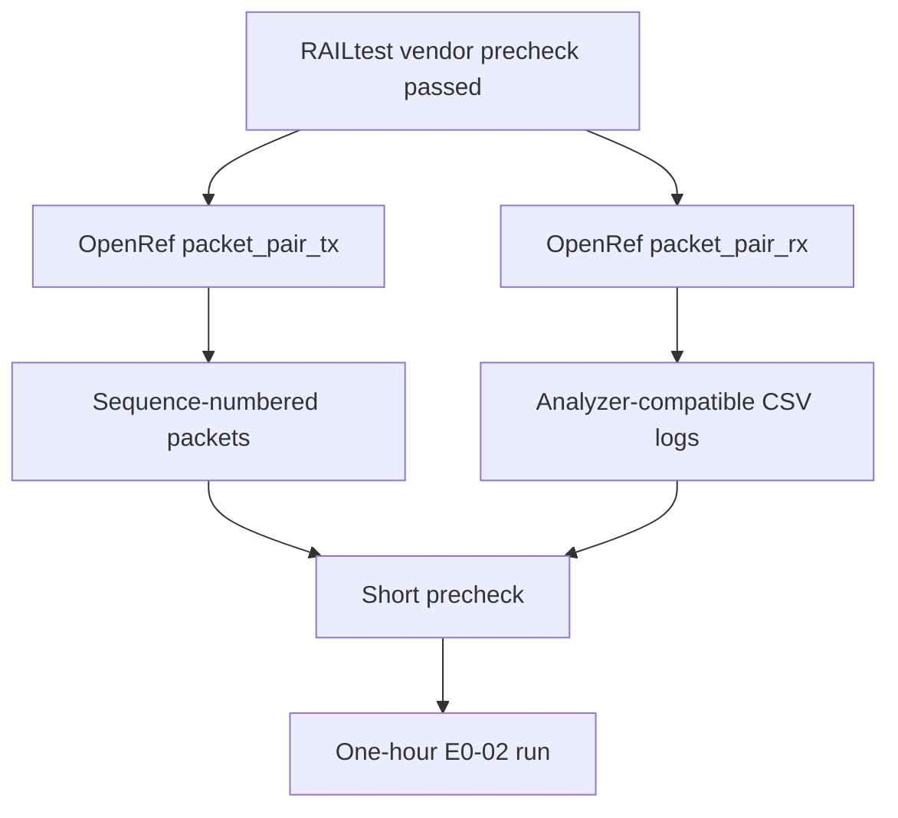

# E0-02 OpenRef Packet-Pair Firmware Plan

**Status:** Packet helper started; FG23 app implementation still pending  
**Prerequisite evidence:** `20260807-railtest-packet-precheck-result.md`

## Goal

Replace the vendor RAILtest packet format with OpenRef-owned packet-pair
firmware that can run the E0-02 one-hour continuous packet test.

## Required Firmware Behavior

| Area | Requirement |
|---|---|
| TX role | Send `OPENREF_PROTO0_PACKET_PING` packets at fixed interval. |
| RX role | Receive packets, validate OpenRef header, log every packet. |
| Packet interval | Start at 20,000 us for simulator alignment. |
| Payload length | Start at 60 payload bytes plus OpenRef header. |
| Sequence | Increment 16-bit sequence in every packet. |
| Timestamp | Include local TX timestamp where SDK timing access allows it. |
| Logging | Emit `event,local_time_us,node_id,sequence,result,detail` CSV rows. |
| Metadata | Log RSSI, LQI, CRC status, packet length, and source ID where exposed. |
| RF path | Use RF path 0 for current FG23-DK2600A bench setup. |
| Logging rate | Avoid verbose per-packet objects; RAILtest notification capture dropped lines at 20 ms even while radio counters showed no packet loss. |

## Implementation Steps

1. Create an OpenRef-owned Simplicity Studio project from the working
   `rail_soc_railtest` configuration.
2. Keep generated SDK/vendor files out of this repository.
3. Add repository-owned source under `firmware/prototype0/fg23/src/`.
4. Implement packet encode/decode helpers for `openref_proto0_packet_header_t`.
   Done in vendor-independent form under `firmware/common/`; compile this in the
   Simplicity/GCC project before flashing custom firmware.
5. Implement compile-time role selection for `packet_pair_tx` and
   `packet_pair_rx`.
6. Add structured CSV serial logging.
7. Run a 5-minute precheck and analyze with `tools/analyze_packet_pair.py`.
8. Run the one-hour E0-02 test only after the precheck has zero unexplained
   resets and no parser gaps.

## Exit Criteria

E0-02 passes only when a one-hour OpenRef-owned packet-pair run records:

- sent packet count;
- received packet count;
- CRC failures or documented SDK limitation;
- sequence gaps;
- reset count;
- min/mean/p95/p99/max inter-arrival time;
- RSSI/LQI statistics where available;
- raw logs and JSON summary under local results;
- a concise committed result summary without local serial numbers.
